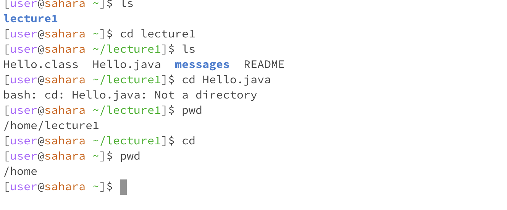
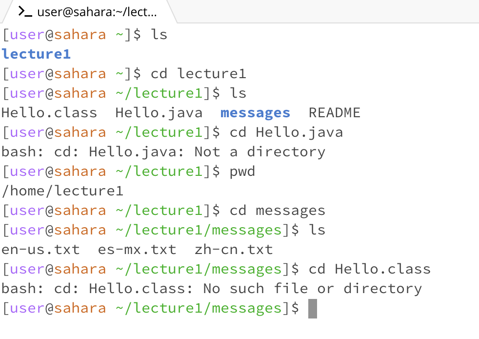
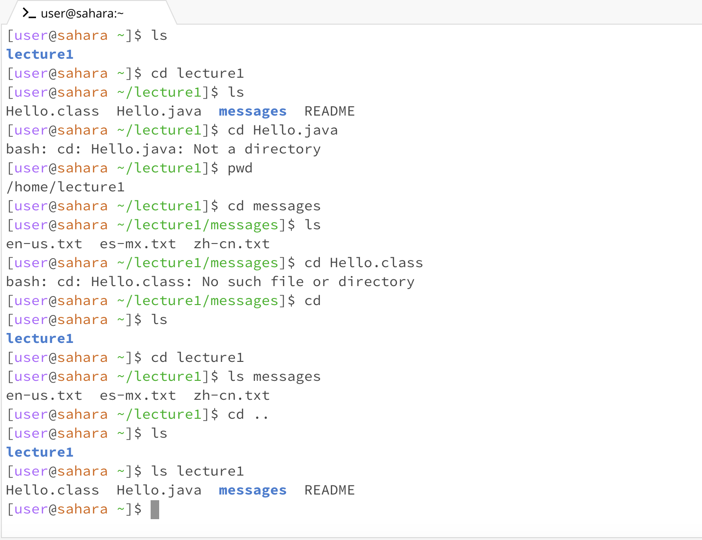
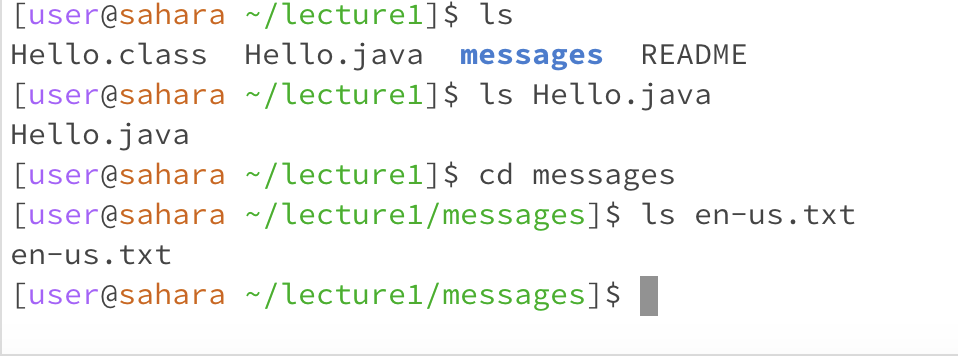
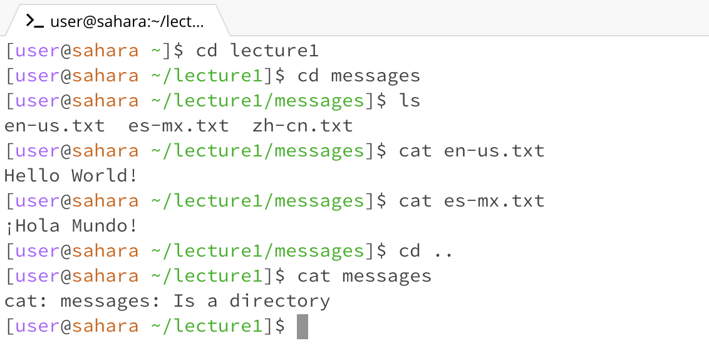

# **Lab Report 1**
We learned 3 terminal commands in the first week of CSE 15L. These are cd, ls and cat, which stand for "change directory", "list" and "concatenate".

I will cover 3 examples of using each Unix command.

Using cd with no arguments changes to the home directory.
Command: cd

The output after I run cd is just /home, which is the home directory. This is because running cd will always switch back to home directory, regardless of the current directory. This output is correct as running cd with no directory after should return to home.

Using with a path to a directory as an argument
Command: cd lecture1

The output of running this in the home directory is that the working directory is now switched to a directory called lecture1. I can continue to switch into other directories that are in lecture1.

Using with a path to a file as an argument.
In the photo above, I also tried to cd using a path to a file as an argument, with the cd Hello.java. This causes an error because Hello.java is not a directory, but instead a Java file. cd can only switch into other directories.

Using ls with no arguments will list out the files and directories in the current working directory. For example, if I'm currently in the home directory, ls will display all contents in home.

Using ls with a path to a directory as an example will list the contents of that directory. In the picture above, when I type ls lecture1, it lists the contents in lecture 1.

Using ls with a path to a file as an argument, will list specific information about that file. In the example above, ls en-us.txt outputs the name of the file.

Using cat without any arguments will result in nothing happening, as the command will wait for input from the user. This is shown in the image above.

Using cat with a path to a directory will result in an error, because cat is used to display the content of files and this isn't possible when given a directory as an argument. This is shown in the picture above with cat messages, and there is an error after.

Using cat with a path to a file as an argument will display the contents of the file that is in the argument. This is shown with cat en-us.txt and cat es-mx.txt.

Share an example of using the command with no arguments.
Share an exmaple of using the command with a path to a directory as an argument.
Share an example of using the command with a path to a file as an argument.
So that’s 9 total examples (3 for each command). For each, include:

A screenshot or Markdown code block showing the command and its output
What the working directory was when the command was run
A sentence or two explaining why you got that output (e.g. what was in the filesystem, what it meant to have no arguments).
Indicate whether the output is an error or not, and if it’s an error, explain why it’s an error.
You will upload your submission by publishing the page on Github Pages, then printing the page to PDF and uploading to the Lab Report 1 assignment on Gradescope.
